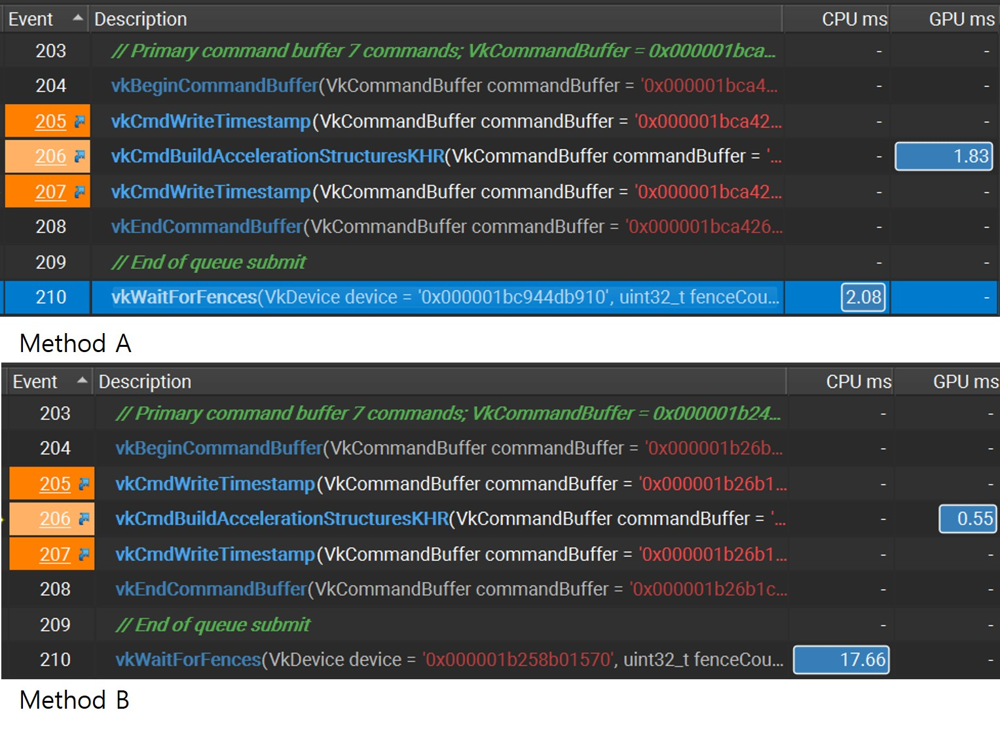
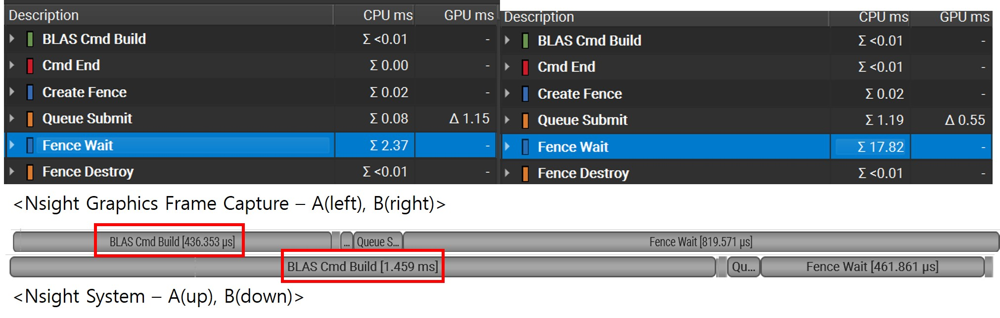

# 개발 경험 및 시행착오
## 1. Cmd Building CPU Overhead
### 1.0 Background
약 2000여개로 클러스터링 된 Mesh를 다음 두 방법으로 Bvh를 빌드할 때,
* A : Single BLAS - Accel Geometry per Cluster
* B : Multi BLAS - BLAS per Cluster

당연히 BLAS가 과하게 많은 B방법이 Acceleration Structuer 빌드 타임도 오래 소요될 것으로 예상했으나

### 1.1 vk TimeStamp로 측정
| 항목  | 방법A  |  방법B |
| :---: | :---: | :---: |
|BLAS Build Time |0.697237 ms |0.391986 ms |
|TLAS Build Time |0.0156524 ms |0.0251618 ms |
|Total Build Time |0.712889 ms |0.417148 ms |
|Tracing Time |0.558497 ms |0.688273 ms |
|FPS |133.655 fps |122.847 fps |

방법 B가 전체 fps는 낮게 나오지만 BLAS Build Time이 말도 안되게 빠르게 나와서 납득이 안갔다.

BLAS `vkCmdBuildAccelerationStructuresKHR` 를 앞뒤로 fence flush 후 nsight grpahics로 살펴보았다.

## 1.2 Nsight Graphics


이미지에 보이듯 ['1.1'](#11-vk-timestamp로-측정) 결과와 같이 GPU time은 B가 빠르지만\
Fence Waiting에서 cpu가 기다리는 시간이 무려 8배 이상이 되었다\
그러나 여전히 TimeStamp(Gpu Time) 상의 시간과 Fence Waiting 상의 시간 간의 괴리에 의문점이 들었다.

## 1.3 Nsight System vs Nsight Graphics
```c++
    nvtxRangePushA("BLAS Cmd Build");
vkCmdBuildAccelerationStructuresKHR(
    cmdBuffer,
    numDynamicBlases,
    dynamicBlasBuildingSets.buildGeometryInfos.data(),
    dynamicBlasBuildingSets.buildRangeInfosArray.data());
    nvtxRangePop();
// ..
    nvtxRangePushA("Fence Wait");
vkWaitForFences(device, 1, &fence, VK_TRUE, DEFAULT_FENCE_TIMEOUT);
    nvtxRangePop();
```

위 코드와 cuda의 nvtx를 활용하여 같이 프로파일링할 시점 앞 뒤로 시간을 측정하였다.\


결과는 fence wait는 gpu time과 거의 비슷하여 문제가 없었고,\
Cmd자체를 빌드하는데에 CPU 시간에서 차이가 났다.

결론 : Cmd 빌드에도 꽤나 CPU 오버헤드가 존재한다. 가능하면 미리 빌드된 CmdBuffer를 사용해야 한다.