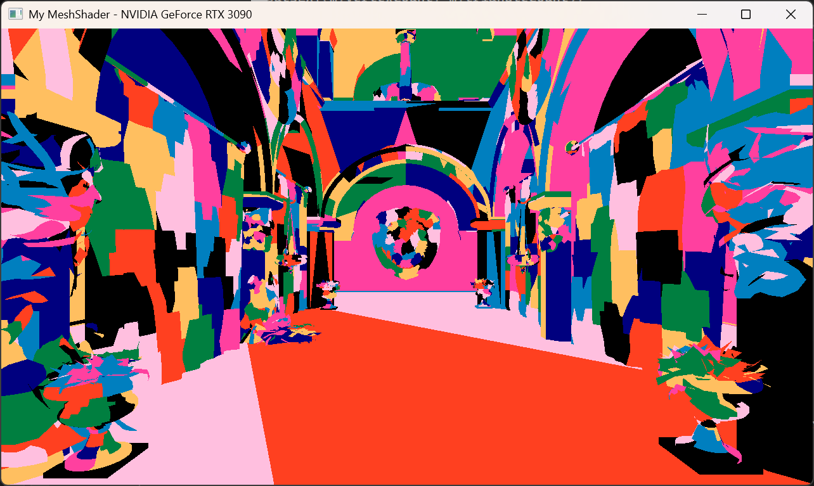

# My Mesh Shader

## Synopsis
Mesh Shader을 활용한 다양한 렌더링 테스트.

Keyword : Mesh Shader, Bindless Rendering

## Description

## Mesh Shader vs Vertex Shader

Vertex 개수 약 11,000,000개의 San Miguel 모델에서 큰 성능 차이를 보임

- Vertex Shader Pipeline : 약 497fps
- Mesh Shader Pipeline : 약 871fps

Mesh Shader에서 Early Culling을 활용하면 더 큰 성능 향상을 기대할 수도 있음.