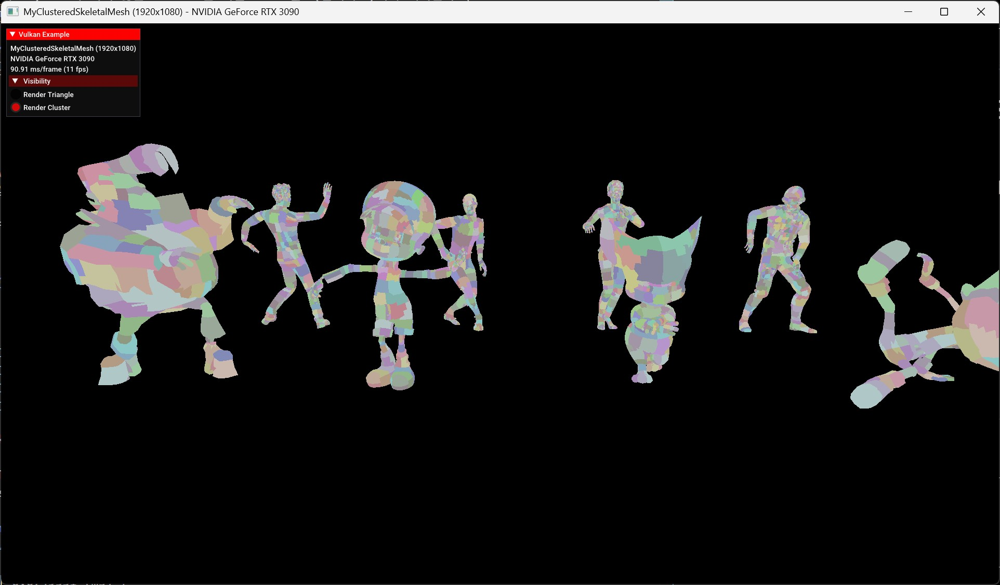

# My Hit Count Based BLAS Building
---
## Table of Contents
+ [Hit Count Based BLAS Building - Clustered Triangle BLAS](#1-Hit-Count-Based-BLAS-Building---Clustered-Triangle-BLAS-link)
<!-- + [Hit Count Based BLAS Building - Clustered BLAS](#2-compare-as-building-performance) -->

Keyword : Cluster Acceleration Structure, Skinning, Raytracing, Hit Count Based Building

**핵심 아이디어**:
오브젝트를 Clustering 후 이전 프레임의 Ray-Hit이 되지 않은 Cluster은 다음 BLAS 빌드(업데이트)를 생략한다.
- idea from GDC2025 - RTX Mega Geometry(https://youtu.be/KblmxDkaUfc?t=2807)

# 1. Hit Count Based BLAS Building - Clustered Triangle BLAS [(link)](./myClusteredSkeletalMesh.cpp)


## Description
클러스터를 전통 BLAS(Triangle BLAS)로 생성하여 CLAS에서 활용할 수 있는 "Hit Count Based Building" 기법을 활용해본다.

## 1.1 Write Hit Info onto Cluster Node
### [closestHit code](../../shaders/glsl/myHitCountBasedBlasBuilding/closesthit.rchit)
```c++
struct ClusterNode
{
    uint32_t numVertices; // num of cluster's vertices
    uint32_t numTriangles; // num of cluster's vertices
    uint32_t firstTriangle; // first triangle offset from global(mesh's) triangles
    uint32_t firstLocalVertex;
    uint32_t firstLocalIndex; // first local triangle's "INDEX" from total local triangles
    uint64_t triangleHitMask;
    uint32_t padding0;
};
sceneClusters.clusters[geometryNode.clusterStartOffset + clusterID].triangleHitMask |= (1 << primitiveID);
```
## 1.2 Compare AS Building Performance (8 Models)
| 항목 | Traditional BLAS | With CLAS | Clustered Triangle BLAS(HCB) |
| :--- | :---: | :---: | :---: |
| **Animation CPU Time** | 4.05584 (ms) |  |  |
| **Animation GPU Time** | 4.33263 (ms) |  |  |
| **CLAS Build Time** | - |  |  |
| **BLAS Build Time** | 0.693201 (ms) |  |  |
| **TLAS Build Time** | 0.0154659 (ms) |  |  |
| **Total AS Build Time** | 0.708667 (ms) |  |  |
| **Tracing Time** | 0.573356 (ms) |  |  |
| **FPS** | 94.422 fps (10.5908 ms) <br><sub>104.42 fps (If MeasureMode Off)</sub> |  |  |


<small>**Thread Block**: **(64, 1, 1)**</small>\
<small>**Num Vertices**: **126,150**</small>\
<small>**Num Triangles**: **234,277**</small>\
<small>**Num Joints**: **640**</small>\
<small>**Measured Frame Count**: **1000**</small>

## 1.3 Additional GPU Memory Usage for Skinning Animation


# Compare Performance (BAD Method!)
## Compare AS Building Performance (8 Models) - ThreadBlock(1,1,1),,,
| 항목 | Traditional BLAS | With CLAS | Clustered Triangle BLAS(HCB) |
| :--- | :--- | :--- | :--- |
| **Animation GPU Time** | 61.345 (ms) | // | // |
| **Average CLAS Build Time** | - | 0.352267 (ms) | - |
| **Average BLAS Build Time** | 0.692217 (ms) | 0.162364 (ms) | 0.275347 (ms)|
| **Average TLAS Build Time** |0.015652 (ms) | 0.0132442 (ms) |0.0276187 (ms)|
| **Average Total AS Build Time** | 0.707869 (ms) | 0.530502 (ms) | 0.302965 (ms)|
| **Average Tracing Time** | 0.556284 (ms) | 0.562901 (ms) | 0.635924 (ms) |
| **Average FPS** | 10.906 fps (91.6926 ms) | 10.95 fps (91.290 ms) |  10.86 fps (92.098 ms)|

<small>**Thread Block**: **(1, 1, 1)**</small>\
<small>**Num Vertices**: **126,150**</small>\
<small>**Num Triangles**: **234,277**</small>\
<small>**Num Joints**: **640**</small>\
<small>**Measured Frame Count**: **1000**</small>


## Compare AS Building Performance (1 Model)
| 항목 | Traditional BLAS | With CLAS | Clustered Triangle BLAS(HCB) |
| :--- | :--- | :--- | :--- |
| **Average CLAS Build Time** | - | 0.0886761 (ms) | - |
| **Average BLAS Build Time** | 0.318392 (ms) | 0.0879172 (ms) | 0.0296483 (ms)|
| **Average TLAS Build Time** |0.0133533 (ms) | 0.0136807 (ms) |0.0211135 (ms)|
| **Average Total AS Build Time** | 0.331745 (ms) | 0.190274 (ms) | 0.0507618 (ms)|
| **Average Tracing Time** | 0.478362 (ms) | 0.483186 (ms) | 0.49135 (ms) |
| **Average FPS** | 90.54 fps (11.045 ms) | 90.61 fps (11.036 ms) |  91.26 (10.958 ms)|

<small>**Thread Block**: **(1, 1, 1)**</small>\
<small>**Num Vertices**: **9,285**</small>\
<small>**Num Triangles**: **17,916**</small>\
<small>**Num Joints**: **168**</small>\
<small>**Measured Frame Count**: **1000**</small>