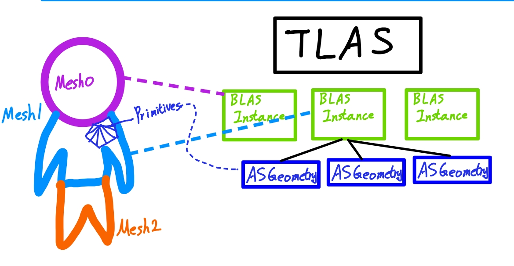
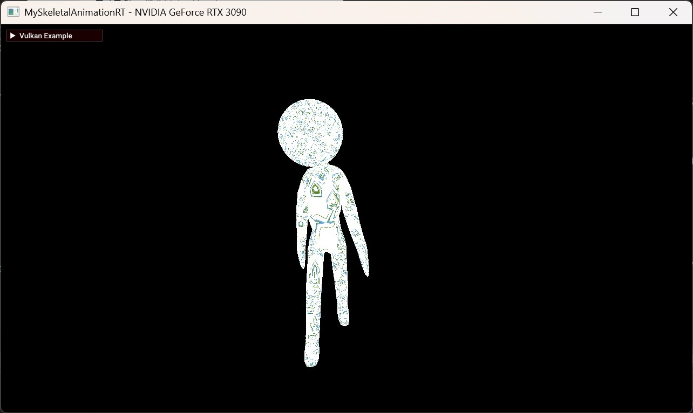

# My Raytracing Little Advanced
---
## Table of Contents
+ [Multi BLAS](#1-multi-blas-link)
+ [Dynamic Acceleration Structure](#2-dynamic-acceleration-structure-link)
+ [Skeletal Mesh Animation RT](#3-Skeletal-Mesh-Animation-Raytracing-link)
+ [Build Acceleration Structure Indirect(deprecated)](#4-build-acceleration-structure-indirectdeprecated)
+ [Others](#others)


# 1. Multi BLAS [(link)](./myMultiBLAS.cpp)


하나의 gltf model을 하나의 BLAS로 생성하는 기존의 구조 대신 Mesh마다 BLAS 생성

Keyword : goemetry node in RT

## Description



### ray와 교차한 삼각형이 buffer을 찾아가는 과정
```glsl
// simplified code
struct GeometryNode {
	uint32_t vertexStartOffset;
	uint32_t indexStartOffset;
	uint32_t primitiveStartOffset;
};

struct Primitive
{
	uint32_t vertexStartOffsetInMesh;
	uint32_t IndexStartOffsetInMesh;
	// material infos per primitive
	// ..
};

void findTriangle()
{
	// Get GeometryNode(Mesh's) via hit BLAS instance (gl_InstanceID)
	GeometryNode geometryNode = sceneNodes[gl_InstanceID];
	// gl_GeometryIndexEXT represents current gltf primitive from mesh
	Primitive meshPrimitive = scenePrimitives[geometryNode.primitiveStartOffset + gl_GeometryIndexEXT];
	
	uint64_t vertexAddress = sceneDeviceAddress.vertexBufferAddress; // vertex buffer is combinded single buffer
	uint64_t triangleIndexOffsetInBytes = 
		INDEX_TYPE_SIZE * (geometryNode.indexStartOffset + meshPrimitive.IndexStartOffsetInMesh + (gl_PrimitiveID * 3));
	uint64_t currentTriangleAddress = sceneDeviceAddress.indexBufferAddress + triangleIndexOffsetInBytes;

	Vertices   vertices = Vertices(vertexAddress);
	Indices    indices = Indices(currentTriangleAddress);	

	//..
}

```

**ray와 삼각형이 충돌하였을 때 알 수 있는 것**

    1. 어떤 BLAS instance인지 (gl_InstanceID)
    2. BLAS instance를 구성하는 geometry 중 어떤 것인지 (gl_GeometryIndexEXT)
    3. 2번의 geometry 중 몇 번째 삼각형인지 (gl_PrimitiveID)

1. blas instance와 mesh 는 1대1 대응이기 때문에 mesh가 갖고 있는 geometryNode 데이터를 가져온다.
2. geometryNode의 primitiveStartOffset을 통해 mesh가 갖고 있는 meshPrimitive의 시작 지점을 받아낸 후 gl_GeometryIndexEXT을 추가적으로 더하여 현 삼각형이 속한 meshPrimitive를 찾는다.
3. geometryNode의 indexStartOffset, meshPrimitive의 IndexStartOffsetInMesh을 활용해 scene의 전체 index buffer 중 현 삼각형의 첫 index 지점(device address) 를 찾아낸다.

---

# 2. Dynamic Acceleration Structure [(link)](./myDynamicAccelerationStructure.cpp)

[MyMultiBLAS](#1-multi-blas-link)  베이스에서 확장

Keyword : dynamic acceleration structure
## Description

### 흐름
- prepare(init) 에서 한 번만 blas 에 대해서만 initBLAS()
	- blas 를 위한 geometry 정보 입력, blas buffer 생성.
- 매 프레임 buildBLASes(), buildTLAS() 호출
	- first build일 경우 vkCreateAccelerationStructureKHR와 vkCmdBuildAccelerationStructuresKHR 모두.
	- update일 경우 vkCmdBuildAccelerationStructuresKHR만


# 3. Skeletal Mesh Animation Raytracing [(link)](./mySkeletalAnimationRT.cpp)


Keyword : skeletal mesh, skinning, animation, compute shader
## Description
### compute skinning [(anim.comp)](../../shaders/glsl/myRayTracingLittleAdvanced/anim.comp)
compute shader로 animation 변환을 하는 것은 실제 vertex data에 write를 하기 때문에 최초의 상태(T pose)가 유지되어야 한다.\
따라서 다음 두 가지 vertex buffer을 사용한다.
1. compute shader의 input으로 활용할 "T pose Vertex Buffer"
2. compute shader의 output으로 활용할 "Deforming Vertex Buffer"

이후 변환된 Deforming Vertex Buffer을 acceleration sturcture build의 input에 입력한다.
```c++
if (isDeformable)
	vertexBuffer = model.deformingVertices.buffer;
else
	vertexBuffer = model.vertices.buffer;
// ....
asGeometry.geometry.triangles.vertexData = getBufferDeviceAddress(vertexBuffer);
```
## Imporvement from Sascha's Matrix Update
```c++
void Node::update()
{
	if (mesh) {
		glm::mat4 m = getMatrix(); // from current to root
		if (skin) {
			mesh->uniformBlock.matrix = m;
			// Update joint matrices
			glm::mat4 inverseTransform = glm::inverse(m);
			for (size_t i = 0; i < skin->joints.size(); i++) {
				myglTF::Node* jointNode = skin->joints[i];
				glm::mat4 jointMat = jointNode->getMatrix() * skin->inverseBindMatrices[i];
				jointMat = inverseTransform * jointMat;
				mesh->uniformBlock.jointMatrix[i] = jointMat;
			}
			//..
		}
		//..
	}
	for (auto& child : children)
		child->update();
}
```
- 위 코드는 Sacha의 Node Update 코드인데 두 가지 문제가 있다.
### 문제 1 : Tree 구조의 이점을 살리지 못한 Joint Node 업데이트
일반적으로 joint(bone) 업데이트는 Top-Down 방식으로 부모 노드의 Matrix에 현재 노드의 Matrix를 곱하여 누적한다.\
이로서 부모 노드에서의 연산을 반복하지 않아도 된다.
그러나 Sascha 코드의 경우 모든 Joint들을 순회하며 부모 노드까지 Down-Top 방향으로 Matrix를 업데이트한다.\
updateJoints() 함수를 추가하여 이를 개선하였다.
```c++
void updateJoints(glm::mat4 parentMatrix, std::array<glm::mat4, MAX_JOINTS>& jointMatrices)
{
	//.. 	
	glm::mat4 curNodeMatrix = localMatrix();
	glm::mat4 toRoot = parentMatrix * curNodeMatrix;

	// curjointSpace -> jointRoot
	jointMatrices[jointIndexInSkin] = toRoot;

	for (auto& child : children)
		child->updateJoints(toRoot, jointMatrices);
}
```
### 문제 2 : 모든 Mesh에 대해 JointMatrix 업데이트

gltf 모델은 다수의 Mesh가 하나의 Skin을 공유할 수 있다.\
따라서 여러 Mesh들이 공유하는 Skin의 Joint들을 1회 업데이트 후 이것을 활용하면 되는데\
Sascha 코드의 경우 Skin을 가지는 Mesh에 대해 모든 Joint Matrix를 업데이트 하도록 되어 있다. 문제1에서 언급한 Down-Top 형식으로 말이다.\
이를 Skin을 가지는 Mesh의 경우 Skin 고유의 JointMatrix 배열을 찾아서 활용하도록 하였다.

```c++
void myglTF::ModelRT::updateNodeTransforms(Node* pNode)
{
	if (pNode->mesh) {
		glm::mat4 m = pNode->getMatrix();
		if (pNode->skin) {
			pNode->mesh->uniformBlock.matrix = m;

			const auto& jointMatrices = rootToMatricesMap[pNode->skin->jointRoot];
			//..
			for (size_t i = 0; i < pNode->skin->joints.size(); i++) {
				myglTF::Node* jointNode = pNode->skin->joints[i];
				glm::mat4 jointMat = jointMatrices[i] * pNode->skin->inverseBindMatrices[i];
				jointMat = inverseTransform * jointMat;
				pNode->mesh->uniformBlock.jointMatrix[i] = jointMat;
				//..
			}
	} //..
}
```
### 성능 향상
| 항목 | 개선 전(Sascha) | 개선 후 |
| :--- | :---: | :---: |
| **Animation CPU Time** | 4.05584 (ms) | 0.87191 (ms) |
| **FPS** | 94.422 fps (10.5908 ms) | 132.076fps (7.5714 ms)<br><sub>78.54% 성능 향상</sub>  |


<small>**Num Vertices**: **126,150**</small>\
<small>**Num Triangles**: **234,277**</small>\
<small>**Num Joints**: **640**</small>\
<small>**Measured Frame Count**: **1000**</small>


# 4. Build Acceleration Structure Indirect(deprecated)
[MyDynamicAccelerationStructure](#2.-My-Dynamic-Acceleration-Structure) 베이스에서 확장

keyword : vkCmdBuildAccelerationStructuresIndirectKHR

## Description
nvidia gpu는 asIndirectBuild를 지원하지 않는다는 것을 알게 되어 중단하였다.\
Legacy code - [myBuildASIndirect.cpp](myBuildASIndirect.cpp)


# Others
## 1. GPU Timer [(code)](../myBase/myVulkanRTBase.h)
```c++
/**
 * @example
 * gpuTimer.reset()
 * gpuTimer.record(, 0)
 * "Record On CommandBuffer Things"
 * gpuTimer.record(, 1)
 * float deltaTime = gpuTimer.timerResult()
 */	
class GPUTimer // in MyVulkanRTBase.h
{
	float timerResult()
	{
		float result = -1.f;
		uint64_t timeStampResult[4]{}; // query0(result, availability), query1(result, availability)
		vkGetQueryPoolResults(device, timeStampQueryPool, 0, queryCount, sizeof(timeStampResult),
			timeStampResult, sizeof(uint64_t) * 2, queryFlag);

		if (timeStampResult[1] && timeStampResult[3]) // availability
		{
			result = float(timeStampResult[2] - timeStampResult[0]) * timestampPeriodDeviceLimit / (1000000.0f);
		}

		return result;
	}
};
```