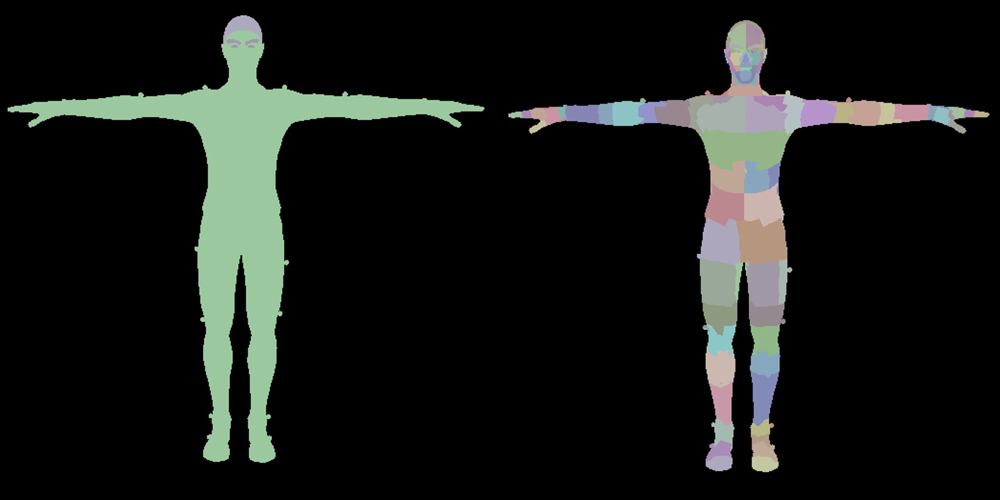

# My Raytracing Little Advanced
---
## Table of Contents
+ [Multi BLAS](#1-multi-blas-link)
+ [Dynamic Acceleration Structure](#2-dynamic-acceleration-structure-link)
+ [Skeletal Mesh Animation RT](#3-Skeletal-Mesh-Animation-Raytracing-link)
+ [Build Acceleration Structure Indirect(deprecated)](#4-build-acceleration-structure-indirectdeprecated)
+ [Bvh Test](#5-bvh-test)
+ [Others](#others)


# 1. Multi BLAS [(link)](./myMultiBLAS.cpp)


하나의 gltf model을 하나의 BLAS로 생성하는 기존의 구조 대신 Mesh마다 BLAS 생성

Keyword : goemetry node in RT

## Description


gltf 모델은 Node-Mesh-Primitive 라는 계층을 가지는데,\
예를 들어 그림처럼 사람이 하나의 Mesh로 표현되면 머리, 몸통, 다리는 하위 계층의 Primitive로 존재한다.\
이번에 시도해본 Multi BLAS 구조는 하나의 gltf Mesh가 하나의 BLAS가 되고, 하위의 gltf Primitive는 하나의 BLAS Geometry(BLAS 하위)가 된다.


### ray와 교차한 삼각형이 buffer을 찾아가는 과정
```glsl
// simplified code
struct GeometryNode {
	uint32_t vertexStartOffset;
	uint32_t indexStartOffset;
	uint32_t primitiveStartOffset;
};

struct Primitive
{
	uint32_t vertexStartOffsetInMesh;
	uint32_t IndexStartOffsetInMesh;
	// material infos per primitive
	// ..
};

void findTriangle()
{
	// Get GeometryNode(Mesh's) via hit BLAS instance (gl_InstanceID)
	GeometryNode geometryNode = sceneNodes[gl_InstanceID];
	// gl_GeometryIndexEXT represents current gltf primitive from mesh
	Primitive meshPrimitive = scenePrimitives[geometryNode.primitiveStartOffset + gl_GeometryIndexEXT];
	
	uint64_t vertexAddress = sceneDeviceAddress.vertexBufferAddress; // vertex buffer is combinded single buffer
	uint64_t triangleIndexOffsetInBytes = 
		INDEX_TYPE_SIZE * (geometryNode.indexStartOffset + meshPrimitive.IndexStartOffsetInMesh + (gl_PrimitiveID * 3));
	uint64_t currentTriangleAddress = sceneDeviceAddress.indexBufferAddress + triangleIndexOffsetInBytes;

	Vertices   vertices = Vertices(vertexAddress);
	Indices    indices = Indices(currentTriangleAddress);	

	//..
}

```

**ray와 삼각형이 충돌하였을 때 알 수 있는 것**

    1. 어떤 BLAS instance인지 (gl_InstanceID)
    2. BLAS instance를 구성하는 geometry 중 어떤 것인지 (gl_GeometryIndexEXT)
    3. 2번의 geometry 중 몇 번째 삼각형인지 (gl_PrimitiveID)

1. blas instance와 mesh 는 1대1 대응이기 때문에 mesh가 갖고 있는 geometryNode 데이터를 가져온다.
2. geometryNode의 primitiveStartOffset을 통해 mesh가 갖고 있는 meshPrimitive의 시작 지점을 받아낸 후 gl_GeometryIndexEXT을 추가적으로 더하여 현 삼각형이 속한 meshPrimitive를 찾는다.
3. geometryNode의 indexStartOffset, meshPrimitive의 IndexStartOffsetInMesh을 활용해 scene의 전체 index buffer 중 현 삼각형의 첫 index 지점(device address) 를 찾아낸다.

---

# 2. Dynamic Acceleration Structure [(link)](./myDynamicAccelerationStructure.cpp)

[MyMultiBLAS](#1-multi-blas-link)  베이스에서 확장

Keyword : dynamic acceleration structure
## Description

### 흐름
- prepare(init) 에서 한 번만 blas 에 대해서만 initBLAS()
	- blas 를 위한 geometry 정보 입력, blas buffer 생성.
- 매 프레임 buildBLASes(), buildTLAS() 호출
	- first build일 경우 vkCreateAccelerationStructureKHR와 vkCmdBuildAccelerationStructuresKHR 모두.
	- update일 경우 vkCmdBuildAccelerationStructuresKHR만


# 3. Skeletal Mesh Animation Raytracing [(link)](./mySkeletalAnimationRT.cpp)


Keyword : skeletal mesh, skinning, animation, compute shader
## Description
### compute skinning [(anim.comp)](../../shaders/glsl/myRayTracingLittleAdvanced/anim.comp)
compute shader로 animation 변환을 하는 것은 실제 vertex data에 write를 하기 때문에 최초의 상태(T pose)가 유지되어야 한다.\
따라서 다음 두 가지 vertex buffer을 사용한다.
1. compute shader의 input으로 활용할 "T pose Vertex Buffer"
2. compute shader의 output으로 활용할 "Deforming Vertex Buffer"

이후 변환된 Deforming Vertex Buffer을 acceleration sturcture build의 input에 입력한다.
```c++
if (isDeformable)
	vertexBuffer = model.deformingVertices.buffer;
else
	vertexBuffer = model.vertices.buffer;
// ....
asGeometry.geometry.triangles.vertexData = getBufferDeviceAddress(vertexBuffer);
```
## Imporvement from Sascha's Matrix Update
```c++
void Node::update()
{
	if (mesh) {
		glm::mat4 m = getMatrix(); // from current to root
		if (skin) {
			mesh->uniformBlock.matrix = m;
			// Update joint matrices
			glm::mat4 inverseTransform = glm::inverse(m);
			for (size_t i = 0; i < skin->joints.size(); i++) {
				myglTF::Node* jointNode = skin->joints[i];
				glm::mat4 jointMat = jointNode->getMatrix() * skin->inverseBindMatrices[i];
				jointMat = inverseTransform * jointMat;
				mesh->uniformBlock.jointMatrix[i] = jointMat;
			}
			//..
		}
		//..
	}
	for (auto& child : children)
		child->update();
}
```
- 위 코드는 Sacha의 Node Update 코드인데 두 가지 문제가 있다.
### 문제 1 : Tree 구조의 이점을 살리지 못한 Joint Node 업데이트
joint(bone) 업데이트는 보통 Top-Down 방식으로 부모 노드의 Matrix에 현재 노드의 Matrix를 곱하여 누적함으로써 자식에서 반복을 피한다.
그러나 Sascha 코드의 경우 모든 Joint들을 순회하며 부모 노드까지 Down-Top 방향으로 Matrix를 업데이트한다.\
updateJoints() 함수를 추가하여 이를 개선하였다.
```c++
void updateJoints(glm::mat4 parentMatrix, std::array<glm::mat4, MAX_JOINTS>& jointMatrices)
{
	//.. 	
	glm::mat4 curNodeMatrix = localMatrix();
	glm::mat4 toRoot = parentMatrix * curNodeMatrix;

	// curjointSpace -> jointRoot
	jointMatrices[jointIndexInSkin] = toRoot;

	for (auto& child : children)
		child->updateJoints(toRoot, jointMatrices);
}
```
### 문제 2 : 모든 Mesh에 대해 JointMatrix 업데이트

gltf 모델은 다수의 Mesh가 하나의 Skin을 공유할 수 있다.\
따라서 여러 Mesh들이 공유하는 Skin의 Joint들을 1회 업데이트 후 이것을 활용하면 되는데\
Sascha 코드의 경우 Skin을 가지는 Mesh에 대해 모든 Joint Matrix를 업데이트 하도록 되어 있다.\
이를 Skin을 가지는 Mesh의 경우 Skin 고유의 JointMatrix 배열을 찾아서 활용하도록 하였다.

```c++
void myglTF::ModelRT::updateNodeTransforms(Node* pNode)
{
	if (pNode->mesh) {
		glm::mat4 m = pNode->getMatrix();
		if (pNode->skin) {
			pNode->mesh->uniformBlock.matrix = m;

			const auto& jointMatrices = rootToMatricesMap[pNode->skin->jointRoot];
			//..
			for (size_t i = 0; i < pNode->skin->joints.size(); i++) {
				myglTF::Node* jointNode = pNode->skin->joints[i];
				glm::mat4 jointMat = jointMatrices[i] * pNode->skin->inverseBindMatrices[i];
				jointMat = inverseTransform * jointMat;
				pNode->mesh->uniformBlock.jointMatrix[i] = jointMat;
				//..
			}
	} //..
}
```
### 성능 향상
| 항목 | 개선 전(Sascha) | 개선 후 |
| :---: | :---: | :---: |
| **Animation CPU Time** | 4.05584 (ms) | 0.87191 (ms)<br><sub>78.54% 성능 향상</sub> |
| **FPS** | 94.422 fps (10.5908 ms) | 132.076fps (7.5714 ms)  |


<small>**Num Vertices**: **126,150**</small>\
<small>**Num Triangles**: **234,277**</small>\
<small>**Num Joints**: **640**</small>\
<small>**Measured Frame Count**: **1000**</small>


# 4. Build Acceleration Structure Indirect(deprecated)
[MyDynamicAccelerationStructure](#2.-My-Dynamic-Acceleration-Structure) 베이스에서 확장

keyword : vkCmdBuildAccelerationStructuresIndirectKHR

## Description
nvidia gpu는 asIndirectBuild를 지원하지 않는다는 것을 알게 되어 중단하였다.\
Legacy code - [myBuildASIndirect.cpp](myBuildASIndirect.cpp)

# 5. BVH Test
## BLAS Build Flag Test
참고 자료 : https://developer.nvidia.com/blog/rtx-best-practices/
1. Method A : `PREFER_FAST_BUILD`
	* Refit 허용 X, BVH Rebuild에 최적화 된 구조
	* ex) 파티클과 같이 지역 변형이 적고 크게 이동하는 경우
2. Method B : `PREFER_FAST_BUILD` | `ALLOW_UPDATE`
	* BVH Rebuild는 A보다 느리지만 Refit 허용
	* ex) Ray 교차할 확률이 비교적 적은 Low-LOD의 오브젝트
3. Method C : `PREFER_FAST_TRACE` | `ALLOW_UPDATE`
	* AS Update 옵션 중 가장 빠른 Trace 연산, 업데이트는 가장 느림.
	* ex) Ray 교차할 확률이 비교적 많은 High-LOD의 오브젝트

보통 동적 물체에는 B가 가장 많이 사용된다.

### Single BLAS Mesh vs Cluster BLAS Mesh A,B,C 테스트



* Single BLAS Mesh는 mesh를 하나의 BLAS로 만드는 기존 방식 (좌)
* Cluster BLAS Mesh는 mesh를 클러스터링 후 각 클러스터를 BLAS화 한 방식 (우)


**Single BLAS Mesh (8 Models)**
| 항목 | **A** | **B** | **C** |
| :---: | :---: | :---: | :---: |
| BLAS Build Time | 0.681594 (ms) | 0.68151 (ms)| 0.825989 (ms) |
| TLAS Build Time | 0.0135525 (ms) | 0.0134731 (ms)| 0.0138656 (ms) |
| **Total AS Build Time** | 0.695147 (ms) | 0.694984 (ms)| 0.839855 (ms) |
| **Tracing Time** | 0.573494 (ms) | 0.570867 (ms)| 0.570171 (ms) |
| **FPS** | 145.803fps (6.85856 ms) | 145.888fps (6.85457 ms) |
<small>**Num BLASes**: **36**</small>

> Single BLAS 같은 경우 A,B는 사실상 같게 나왔고, C는 BLAS 빌드 시간이 증가했을 뿐 Tracing에서도 이점은 없었다.\
삼각형 개수가 더 많은 모델에 적용해야 이점이 있을 것으로 보인다.

**Cluster BLAS Mesh (8 Models)**


| 항목 | **A** | **B** | **C** |
| :---: | :---: | :---: | :---: |
| BLAS Build Time | 0.380535 (ms) | 0.388019 (ms)| 9.20738 (ms) |
| TLAS Build Time | 0.0235938 (ms) | 0.0236705 (ms)| 0.0238507 (ms) |
| **Total AS Build Time** | 0.404129 (ms) | 0.41169 (ms)| 9.23123 (ms) |
| **Tracing Time** | 0.694935 (ms) | 0.694623 (ms)| 0.55975 (ms) |
| **FPS** |  148.291fps (6.74348 ms) | 148.944fps (6.71394 ms) | 62.7536fps (15.9353 ms) |
<small>**Num BLASes**: **2127**</small>

> A가 B보다 빌드 시간이 미세하게 빠른 것을 확인할 수 있고,\
C의 경우 삼각형의 개수는 같지만 리빌드해야 하는 BLAS 자체의 개수가 증가하여 BLAS 빌드 시간이 눈에 띄게 증가한 것을 볼 수 있다. 

<small>**Num Vertices**: **9,285**</small>\
<small>**Num Triangles**: **17,916**</small>\
<small>**Num Joints**: **168**</small>


## blas per cluster vs geometry per cluster
<!--  -->


# Others
## 1. GPU Timer [(code)](../myBase/myVulkanRTBase.h)
```c++
/**
 * @example
 * gpuTimer.reset()
 * gpuTimer.record(, 0)
 * "Record On CommandBuffer Things"
 * gpuTimer.record(, 1)
 * float deltaTime = gpuTimer.timerResult()
 */	
class GPUTimer // in MyVulkanRTBase.h
{
	float timerResult()
	{
		float result = -1.f;
		uint64_t timeStampResult[4]{}; // query0(result, availability), query1(result, availability)
		vkGetQueryPoolResults(device, timeStampQueryPool, 0, queryCount, sizeof(timeStampResult),
			timeStampResult, sizeof(uint64_t) * 2, queryFlag);

		if (timeStampResult[1] && timeStampResult[3]) // availability
		{
			result = float(timeStampResult[2] - timeStampResult[0]) * timestampPeriodDeviceLimit / (1000000.0f);
		}

		return result;
	}
};
```