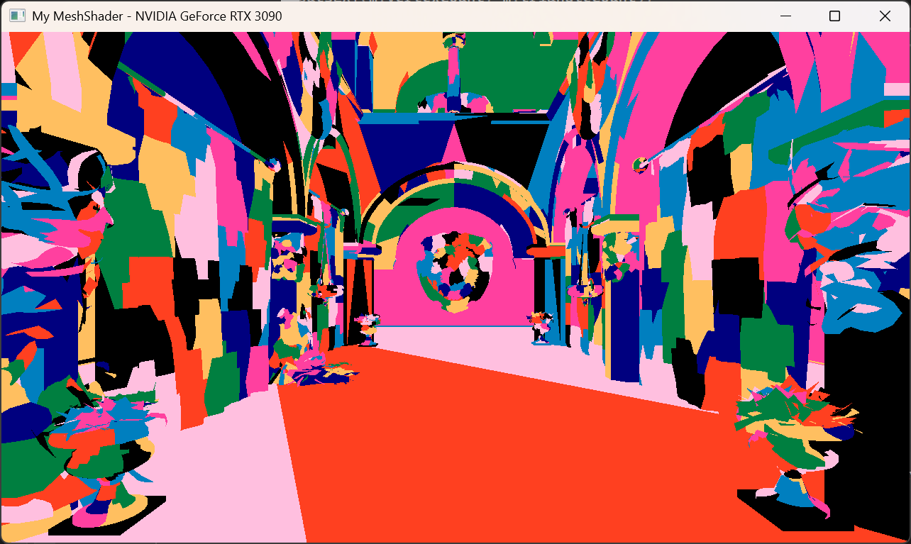
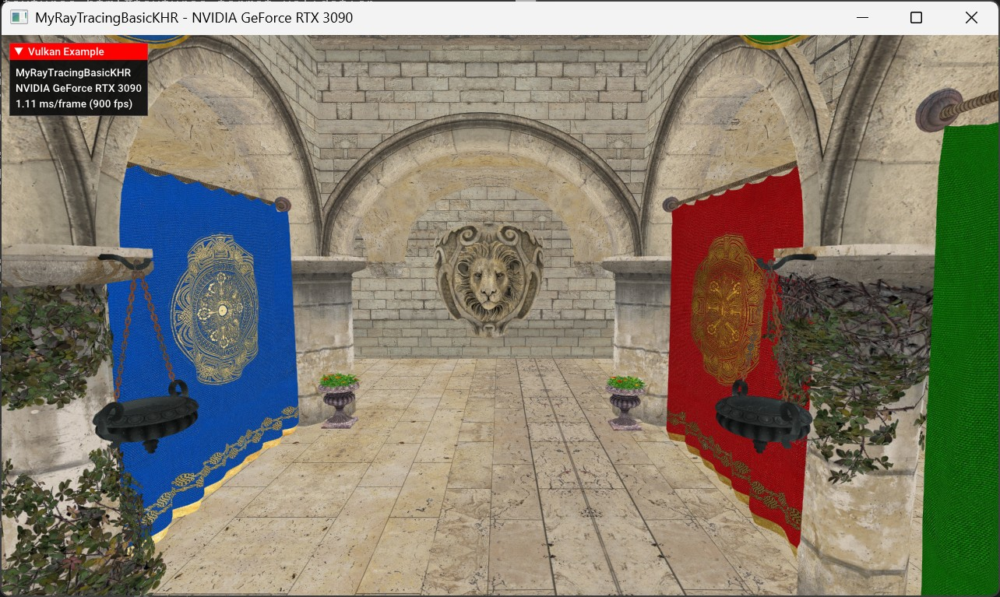
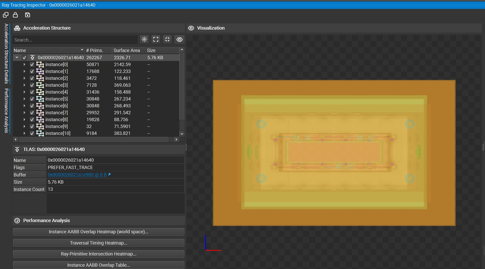

# Vulkan Playground

## 📌 This project is a fork of [Sascha Willems Vulkan Demos](https://github.com/SaschaWillems/Vulkan).
You can view the original README [here](https://github.com/SaschaWillems/Vulkan#readme).

## Table of Contents
+ [My Devs](#my-devs)
    + [My Mesh Shader](#mesh-shader)
    + [Ray Tracing](#ray-tracing)

## My Devs

### Mesh Shader

- [My Mesh Shader](MyDevs/myMeshShader/)

    

### Ray Tracing

- [Ray Tracing Basic](MyDevs/myRaytracingBasic/) - Basic Ray Tracing similar to Sascha's implementation

    
- [Multi BLAS](MyDevs/myMultiBLAS/) - Multiple BLASes per gltf model.

    
    
- [NV Cluster Acceleration Structuer](MyDevs/myClusterAccelerationStructureNV/)