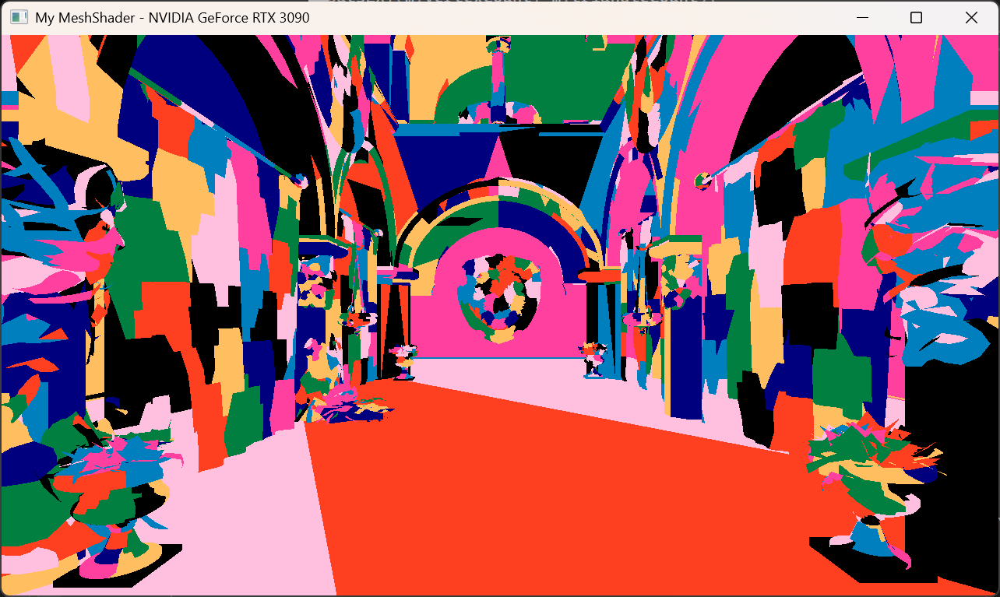
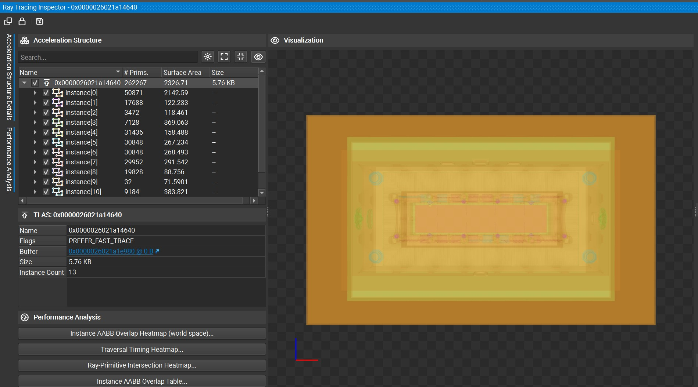
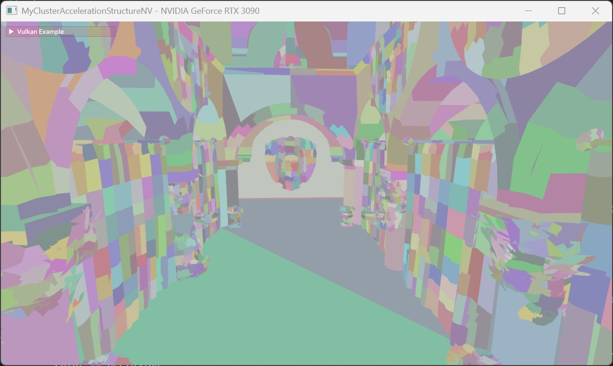
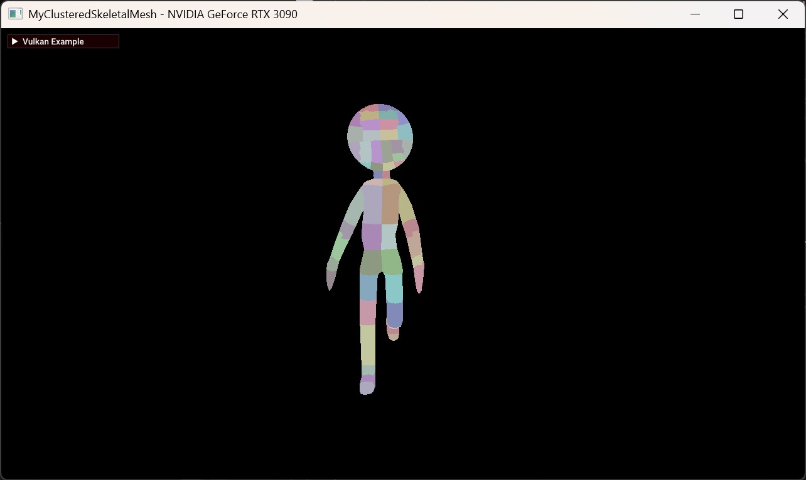

# Vulkan Playground

## 📌 This project is a fork of [Sascha Willems Vulkan Demos](https://github.com/SaschaWillems/Vulkan).
You can view the original README [here](https://github.com/SaschaWillems/Vulkan#readme).

## Table of Contents
+ [My Devs](#my-devs)
    + [Mesh Shader](#mesh-shader)
    + [Ray Tracing](#ray-tracing)

## My Devs

### Mesh Shader

- [My Mesh Shader](MyDevs/myMeshShader/)

    

### Ray Tracing

- [My Raytracing Little Advanced](MyDevs/myRayTracingLittleAdvanced//) - Multi BLAS, Dynamic AS, AnimationRT, ,,,

    

### Ray Tracing - Clustered Scene    
- [NV Cluster Acceleration Structuer](MyDevs/myClusterAccelerationStructureNV/)

    
    
- [Clustered Skeletal Mesh (CLAS)](MyDevs/myClusteredSkeletalMesh/)

    
    
- [ Hit Count Based BLAS Building](MyDevs/myHitCountBasedBlasBuilding//)

    - 이전 프레임의 Ray-Hit이 되지 않은 Cluster은 다음 BLAS 빌드(업데이트) 생략 + 성능 비교

## About Coding Convention...
기존 sascha의 convention을 따르려 하였으나, 멤버 변수와 지역 변수의 혼동이 우려되는 경우에 한해 멤버 변수 앞에 "m_" prefix 붙임.